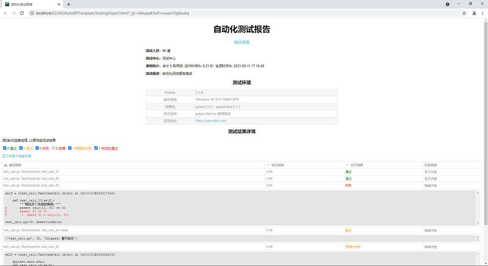
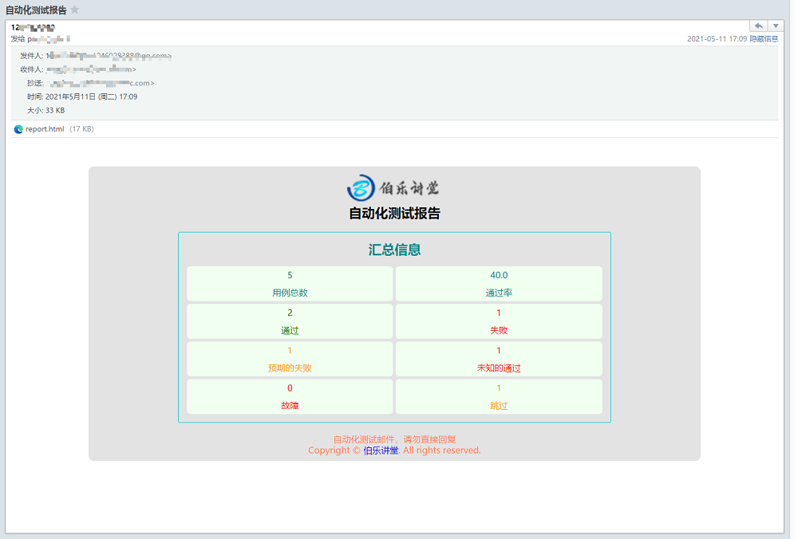

pytest-html-cn
==============

``pytest-html-cn`` 是一个基于 ``pytest-html 2.1.1`` 进行的汉化优化版本, 而 ``pytest-html`` 是 `pytest <http://pytest.org>`_ 的一个插件, 用于生成一份 HTML 版本的测试报告。

注意
----
本插件安装后会覆盖 ``pytest-html`` , 使用方式相同.

安装
----

Install pytest-html-cn from GitHub:

.. code:: bash

  $ git clone https://github.com/pansfy/pytest-html-cn

  $ cd pytest-html-cn/

  $ pip install .     # Normal installation

  $ pip install -e .  # Editable install

Then run your tests with:

.. code:: bash

  $ pytest --html=report.html

个性化配置
----------

``conftest.py``

.. code:: python

    import pytest

    @pytest.mark.optionalhook
    def pytest_html_report_title(report):
        """自定义测试报告概要信息"""
        report.title = "自动化测试报告"
        report.company = {"name": "伯乐讲堂", "url": "https://pansaifei.com"}
        report.description = "自动化测试报告描述"
        report.tester = "Mr.潘"
        report.department = "测试中心"

    def pytest_configure(config):
        """自定义测试环境相关信息"""
        config._metadata["ProjectName"] = "pytest-html-cn 使用测试"
        config._metadata["ProjectURL"] = 'https://pansaifei.com'
        config._metadata['Packages'] = "pytest 5.4.3、pytest-html 2.1.1"
        config._metadata.pop("JAVA_HOME")
        config._metadata.pop("Plugins")

    @pytest.hookimpl(tryfirst=True)
    def pytest_sessionfinish(session):
        """自定义测试运行后行为"""
        session.is_email = False
        session.email_cfg = {
            'user': '发件人邮箱',
            'password': '邮箱授权码',
            'host': '邮箱SMTP服务器'
        }
        session.send_cfg = {
            'to': '收件人邮箱',  # 收件人，多个收件人使用列表
            'cc': '抄送人邮箱'  # 抄送人，多个抄送人使用列表，可选项
        }

注意
----

开启邮件发送功能时，建议使用 ``pytest`` 运行测试时附带 ``--self-contained-html`` 项, 可以确保测试报告附件的完整性。

效果图
------

